# ContainPoint

**SPCC Compliance System of Record** — A production-quality B2B compliance SaaS for qualified Tier I and Tier II facilities. ContainPoint models the SPCC Plan as a structured, versioned compliance artifact connected to live facility data—not as a static PDF.

---

## Table of Contents

- [Overview](#overview)
- [Getting Started](#getting-started)
- [Dashboard Guide](#dashboard-guide) — login through org settings & screenshots
- [Feature Reference](#feature-reference)
- [Tech Stack](#tech-stack)
- [Project Structure](#project-structure)
- [Capturing Screenshots](#capturing-screenshots)

---

## Overview

ContainPoint is designed for facilities subject to the EPA's Spill Prevention, Control, and Countermeasure (SPCC) rule. It provides:

- **Structured plan management** — Versioned SPCC plans with 13 required sections, certification tracking, and approval workflows
- **Asset & containment registries** — Oil storage inventory, secondary containment structures, and asset–containment linking
- **Inspection engine** — Asset-class-aware templates, scheduled inspections, execution with evidence-grade records and signatures
- **Corrective action tracking** — From inspection failures through closure
- **Training & annual briefings** — Personnel records and sign-off tracking
- **Incident / discharge log** — Spill history with severity, root cause, and response actions
- **5-year review & amendments** — Formal review workflow with amendment tracking
- **Export center** — Generate Plan summaries, inspection reports, corrective action registers, training logs, incident logs, and full audit packs
- **Consultant portfolio** — Multi-facility oversight for consultants and org admins
- **Compliance assistant** — OpenAI chat with RAG over curated SPCC/product docs plus live facility context
- **Obligations calendar** — Regulatory inspection and review milestones in one facility timeline
- **Internal admin bridge** — Optional signed link from the separate **ContainPoint Admin** app lets staff open the dashboard as a tenant user for support (shared `ADMIN_DASHBOARD_BRIDGE_SECRET`).

---

## Getting Started

### Prerequisites

- **Node.js 18+**
- **PostgreSQL** (or [Prisma Postgres](https://www.prisma.io/docs/orm/prisma-client/setup-and-configuration/databases) for local dev)

### Quick Start

```bash
# Clone and install
git clone <repo-url>
cd dashboard
npm install

# Database
npx prisma migrate dev
npm run db:seed

# Run
npm run dev
```

Open [http://localhost:3000](http://localhost:3000).

### Environment Variables

Copy `.env.example` to `.env` and set:

| Variable     | Description                          |
|-------------|--------------------------------------|
| `DATABASE_URL` | PostgreSQL connection string       |
| `AUTH_SECRET`  | `openssl rand -base64 32`          |
| `AUTH_URL`     | e.g. `http://localhost:3000`       |
| `NEXT_PUBLIC_SUPABASE_URL` | Supabase project URL (for file storage) |
| `SUPABASE_SERVICE_ROLE_KEY` | Supabase service role key (for file storage) |
| `OPENAI_API_KEY` | OpenAI API key for the facility **Assistant** (chat + embeddings) |
| `OPENAI_CHAT_MODEL` | Optional chat model id (default `gpt-4o-mini`) |
| `ADMIN_DASHBOARD_BRIDGE_SECRET` | Same 32+ character secret as the internal admin app (enables support “open in dashboard” links); optional if you do not use the admin console |

**Compliance assistant:** After `npx prisma migrate dev`, run `npm run ingest:knowledge` (requires `OPENAI_API_KEY` and `DATABASE_URL`) to embed markdown under `data/compliance-knowledge/` into `ComplianceKnowledgeChunk`. Add or edit those `.md` files, then re-run ingest to refresh RAG.

**Supabase Storage (for Vercel / production):** When both Supabase env vars are set, uploaded files and exports are stored in Supabase instead of the local filesystem. Create a bucket named `uploads` in your Supabase project (Storage → New bucket). If Supabase is not configured, files use `./uploads` locally.

### Demo Credentials

After running `npm run db:seed`:

| Field    | Value                     |
|----------|---------------------------|
| Email    | `seed@containpoint.com`   |
| Password | `Seed1234!`               |

The seeded org has three demo facilities: North Valley Fleet Depot, Central Equipment Yard, and East Manufacturing Site.

---

## Dashboard Guide

This section walks through the main screens and how they work.

### 1. Login

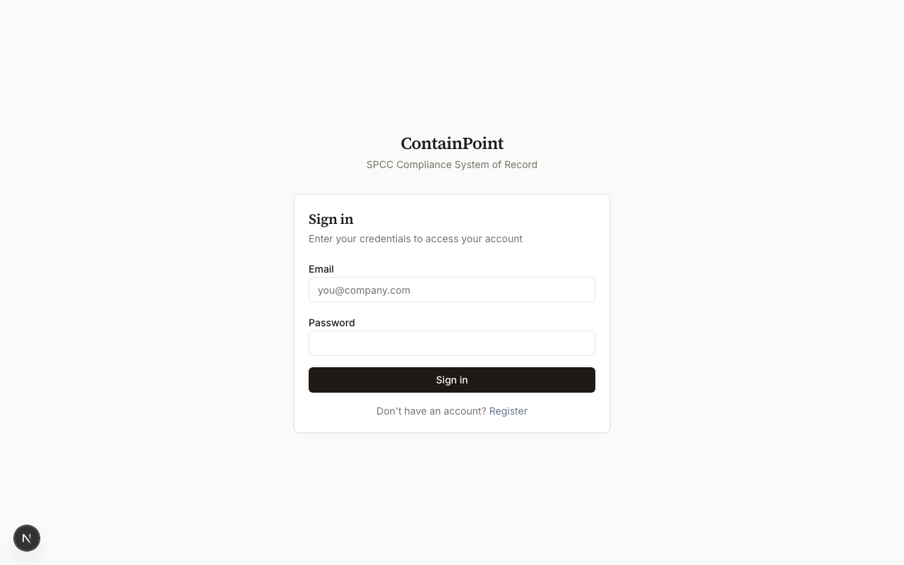

The login page uses credentials authentication via NextAuth. Enter your email and password to access the application. Users are associated with an organization; org admins see all facilities, while facility managers see only facilities they are assigned to.

---

### 2. App Dashboard

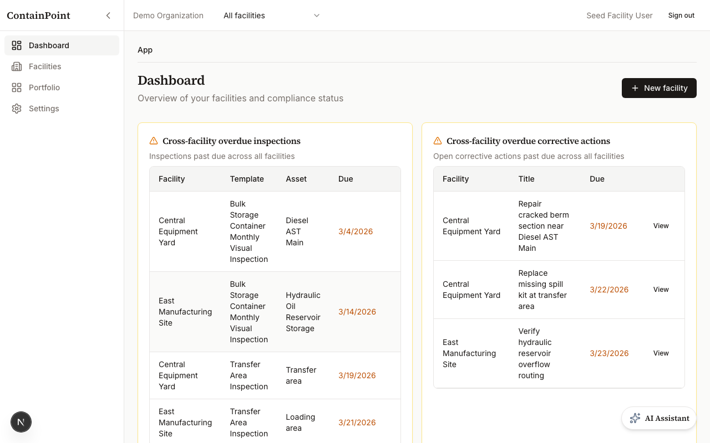

The **org-level dashboard** is the landing page after login. It shows:

- **Facilities** — A table of all facilities you can access, with qualification tier, compliance status, asset count, and containment unit count
- **Cross-facility overdue items** — If you have multiple facilities, any overdue inspections or corrective actions are surfaced in amber-bordered cards
- **Quick actions** — "New facility" and "View" links for each facility

Use the sidebar to navigate: **Dashboard**, **Facilities**, **Portfolio**, and **Settings**. When you open a specific facility, the sidebar switches to facility-scoped navigation.

---

### 3. Facilities List

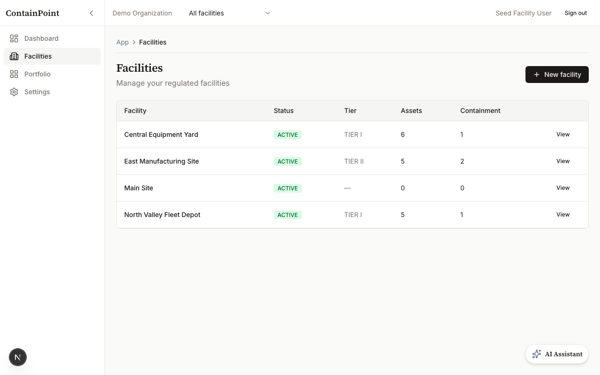

The facilities list provides a summary table of all facilities in your organization. Columns include:

| Column     | Description                                |
|------------|--------------------------------------------|
| Facility   | Facility name (links to facility dashboard) |
| Status     | DRAFT, ACTIVE, INACTIVE, ARCHIVED          |
| Tier       | Qualification tier (TIER_I, TIER_II, etc.) |
| Assets     | Count of registered assets                 |
| Containment| Count of containment units                 |

Click a facility name or **View** to enter the facility dashboard.

---

### 4. Facility Dashboard

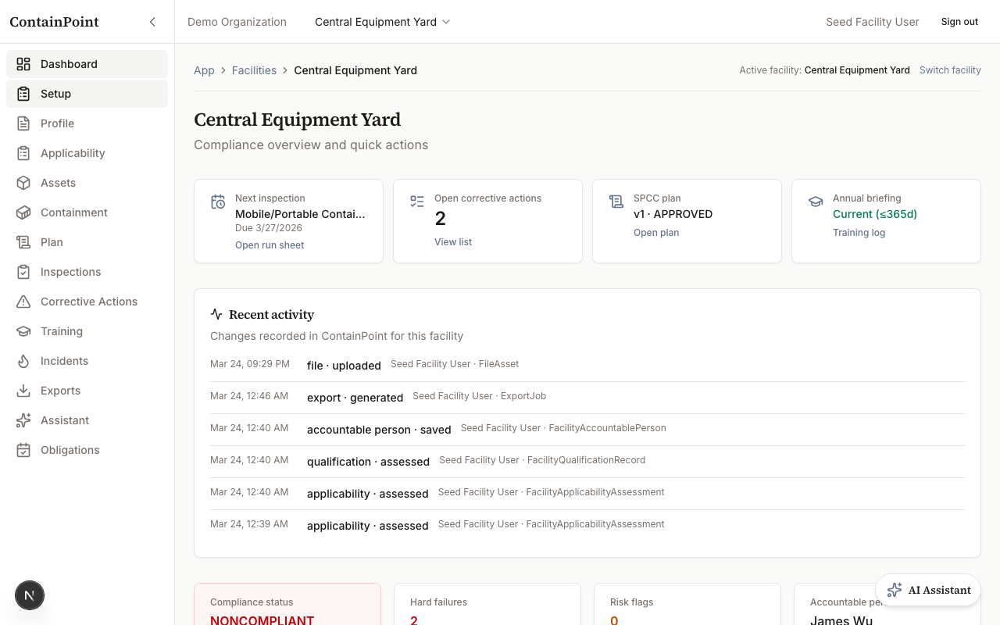

The **facility dashboard** is the main compliance overview for a single facility. It displays:

- **Compliance status** — COMPLIANT, AT_RISK, or NONCOMPLIANT (from the validation engine)
- **Hard failures** — Count of blocking issues (e.g., overdue inspections, unsigned records)
- **Risk flags** — Warnings that don’t block compliance
- **Upcoming inspections** — Inspections due soon with template and asset
- **Overdue corrective actions** — Open actions past due date
- **5-year review** — Next review due date from the facility profile
- **Annual briefing** — Whether a recent annual briefing has been completed

Quick links take you to Setup, Profile, Assets, Containment, Plan, Inspections, Corrective Actions, and Training.

---

### 5. Plan Overview

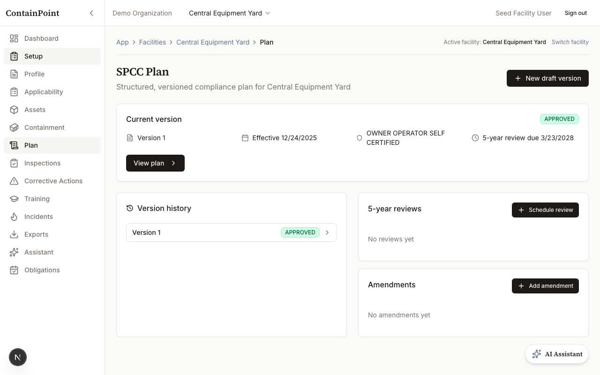

The **SPCC Plan** is modeled as structured data, not just an uploaded file. The plan overview shows:

- **Current version** — Version number, effective date, certification type (Owner/Operator self-certified or PE certified), and next 5-year review date
- **Version history** — All plan versions with status (DRAFT, IN_REVIEW, APPROVED, SUPERSEDED)
- **5-year reviews** — Scheduled and completed reviews with status
- **Amendments** — Amendment records linked to the plan

You can create a new draft version (when no draft exists), view the current version, or continue editing an existing draft.

---

### 6. Plan Version Detail

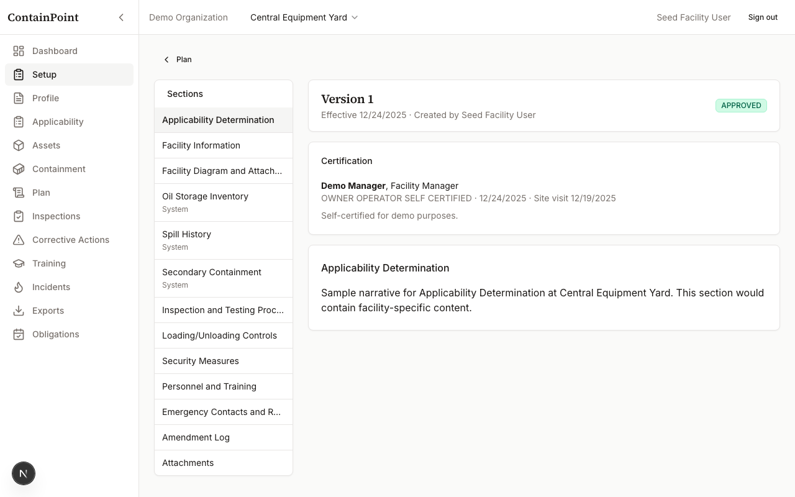

The **plan version detail** page provides:

- **Section sidebar** — Navigation for all 13 plan sections:
  - Applicability, Facility Information, Facility Diagram & Attachments
  - Oil Storage Inventory, Spill History, Secondary Containment
  - Inspection & Testing Procedures, Loading/Unloading Controls
  - Security Measures, Personnel & Training
  - Emergency Contacts & Response Notes
  - Amendment Log, Attachments

- **Section content** — Editable narrative text for each section (when the version is in DRAFT or IN_REVIEW)
- **System-generated sections** — Sections like Oil Storage Inventory and Spill History can be populated from live facility data
- **Certification block** — Shown for approved versions (certifier name, title, date, site visit)
- **Approve & lock** — For draft versions, opens a dialog to record certification details and lock the version

Approved versions are read-only. New drafts are created from the current approved version.

---

### 7. Incidents

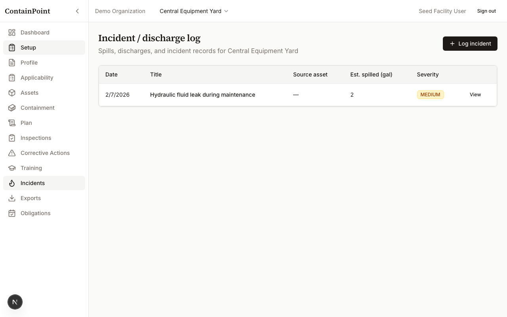

The **Incident / Discharge Log** records spills and discharges. For each incident you can capture:

- Title, date/time, severity (LOW, MEDIUM, HIGH, CRITICAL)
- Source asset (optional link to an asset)
- Estimated total spilled (gal), estimated amount to water (gal)
- Impacted waterbody, cause, immediate actions, notes

High-severity incidents are highlighted with a warning banner. Incident history feeds into the plan’s Spill History section and can affect qualification.

---

### 8. Export Center

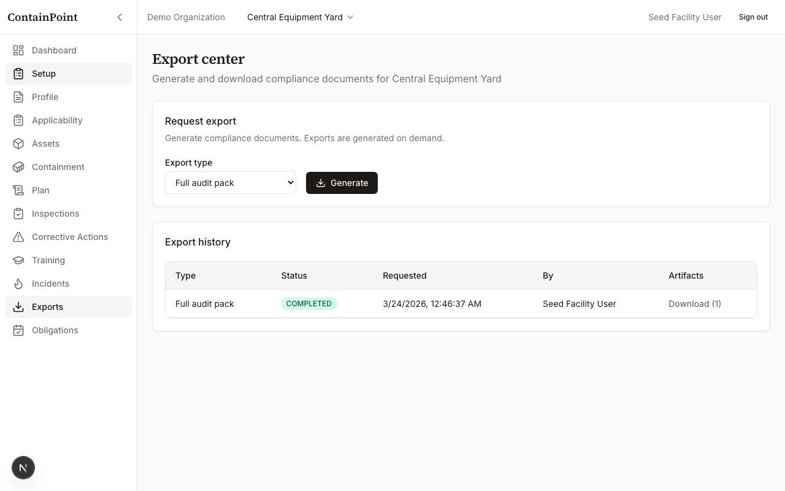

The **Export Center** generates compliance documents from live data. Available export types:

| Export Type            | Description                               |
|------------------------|-------------------------------------------|
| Plan (PDF)             | SPCC Plan summary                         |
| Inspection report      | Inspection history and schedules          |
| Corrective action register | Open and closed corrective actions   |
| Training log           | Training events and attendance            |
| Container inventory    | Asset/container list                      |
| Containment basis      | Containment units and capacity            |
| Review memo            | 5-year review records                     |
| Incident log           | Spill/discharge history                   |
| **Full audit pack**    | Bundled compliance evidence               |

Select a type, click **Generate**, and the system creates a PDF artifact. Completed exports appear in the history table with a download link.

---

### 9. Portfolio

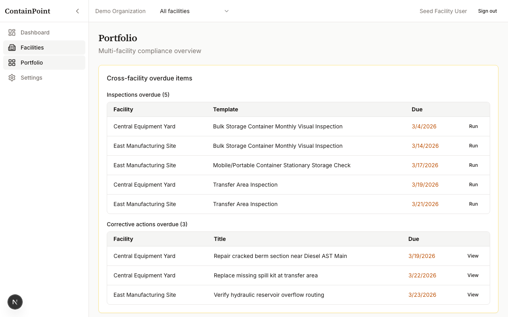

The **Portfolio** page is a consultant/multi-facility view. It shows:

- **Cross-facility overdue items** — Inspections and corrective actions overdue across all facilities
- **Facilities table** — Facility name, qualification tier, plan status, 5-year review date, annual briefing status, asset count, and open corrective actions

Use it to see compliance status at a glance and quickly jump to specific facilities or overdue items.

---

### 10. Assets

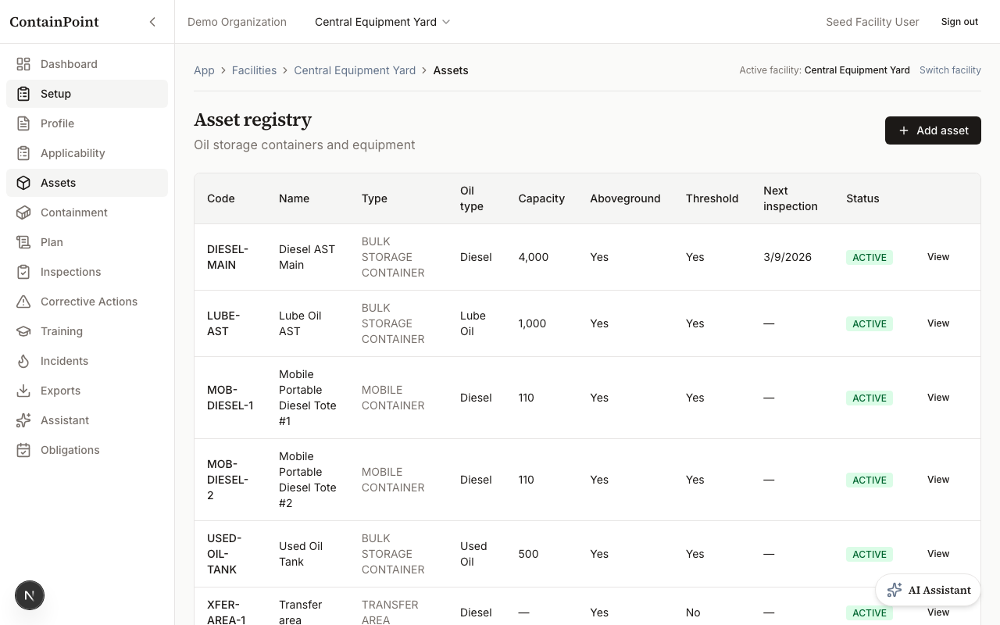

The **Asset Registry** lists all oil storage containers and related equipment. Columns include:

- Code, name, type (bulk storage, drum, transformer, mobile container, etc.)
- Oil type, capacity (gal), status
- Linked containment, last inspection date

Assets can be linked to containment units and inspection templates. They feed into the plan’s Oil Storage Inventory section.

---

### 11. Inspections

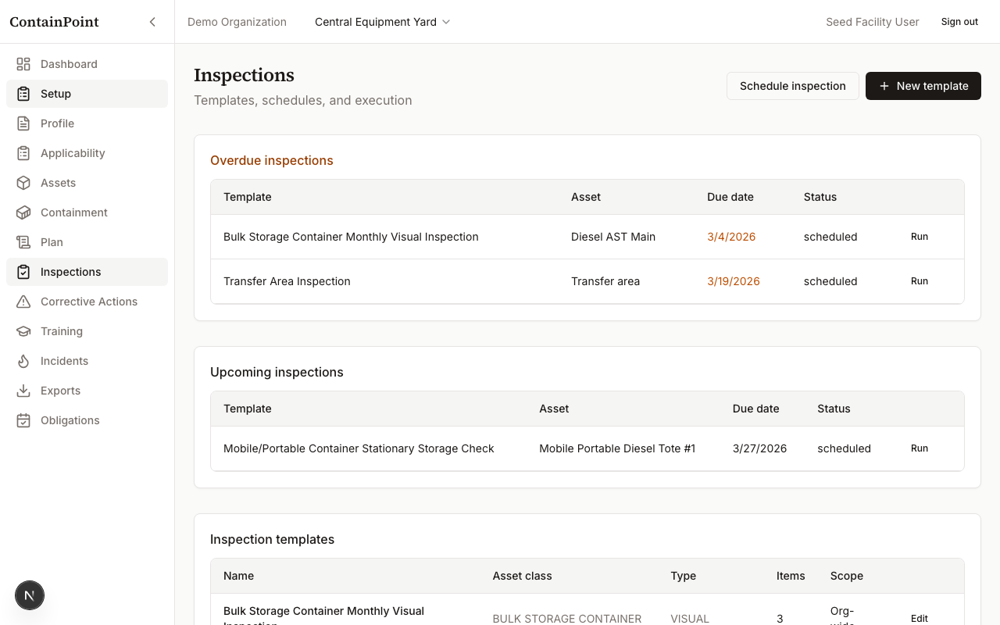

The **Inspections** area covers:

- **Templates** — Asset-class-aware inspection templates with configurable items
- **Schedule** — Scheduled inspections with due dates, templates, and assigned assets
- **Execution** — Run inspections, record results, capture evidence, and sign to lock records

Completed inspections can trigger corrective actions. Inspection history supports the plan’s Inspection & Testing Procedures section.

---

### 12. Setup wizard

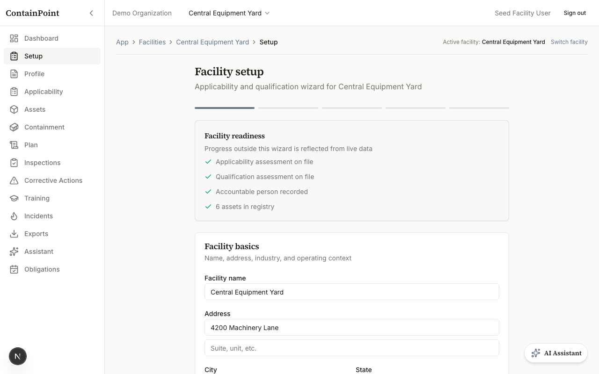

The **Setup** flow guides new facilities through applicability, qualification, profile, accountable person, and initial registries, with progress tracked against live server state.

---

### 13. Applicability

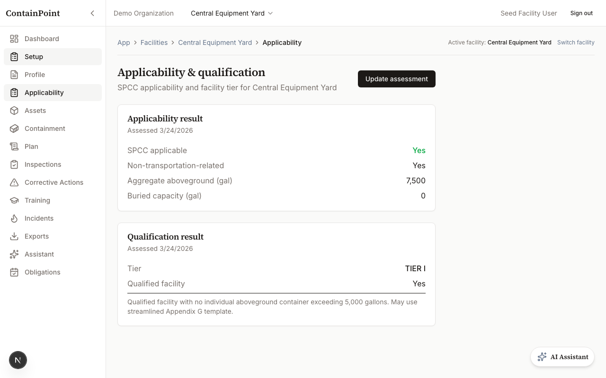

Record **SPCC applicability** determinations (capacity thresholds, discharge expectations, exclusions) with assessment history for the facility.

---

### 14. Containment registry

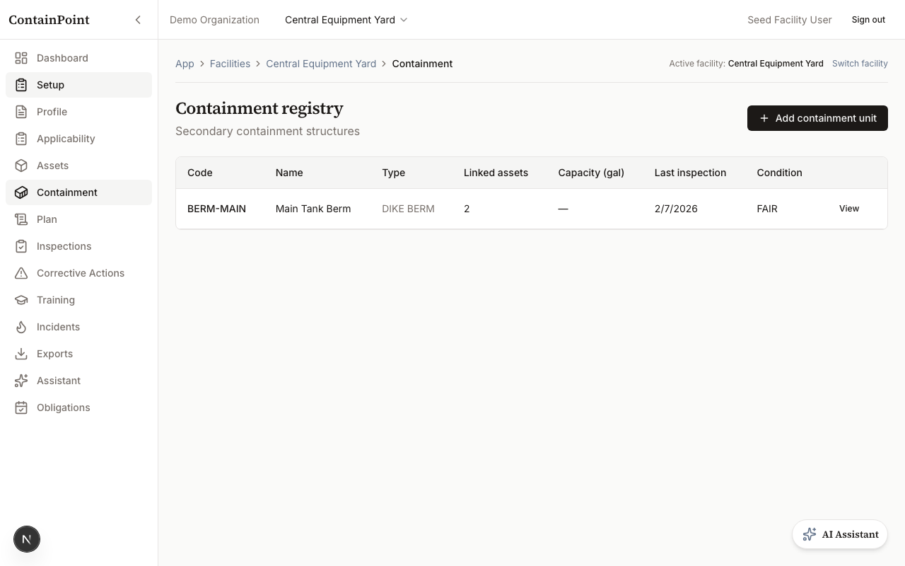

Manage **secondary containment** units, link assets to containment, and document basis of design data used in plans and exports.

---

### 15. Corrective actions

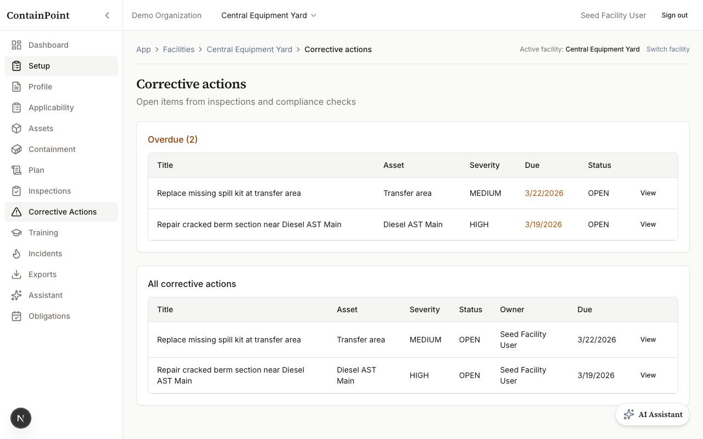

Track **corrective actions** from failed inspections through assignment, comments, evidence, and closure—surfaced on the facility dashboard and portfolio when overdue.

---

### 16. Training

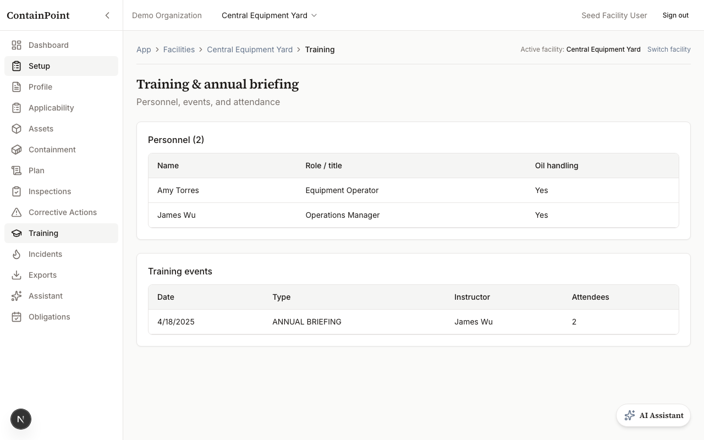

**Training events**, attendance, and signatures support annual briefing and PE/operator training recordkeeping.

---

### 17. Compliance assistant

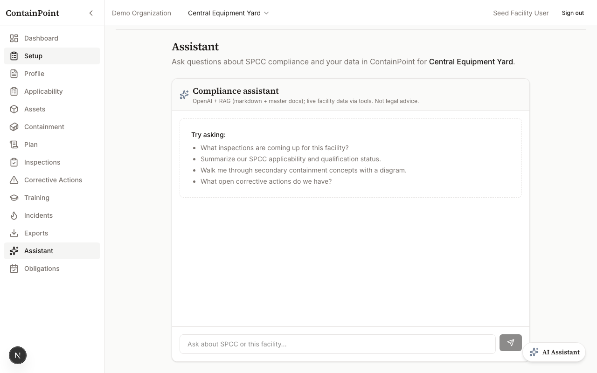

The **Assistant** provides facility-scoped chat (RAG over ingested compliance knowledge plus tools). Requires `OPENAI_API_KEY` and a successful `npm run ingest:knowledge` for grounded answers.

---

### 18. Obligations calendar

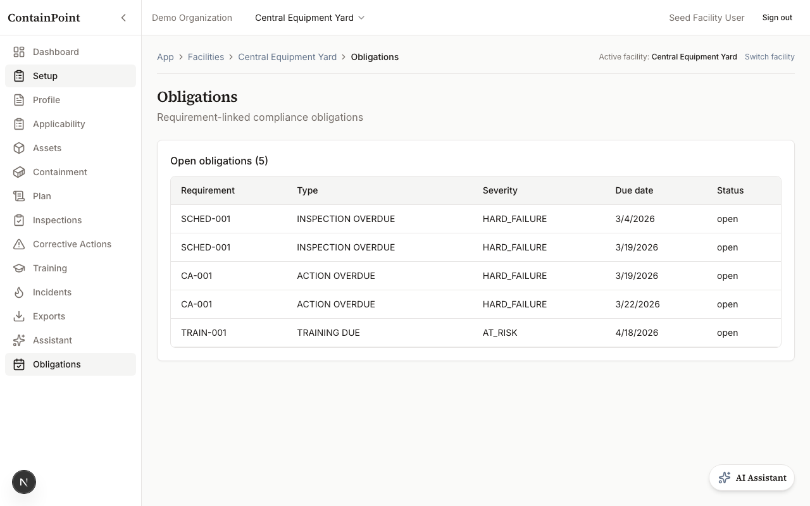

The **Obligations** view aggregates inspection, review, and related due dates for quick scanning of upcoming regulatory work.

---

### 19. Organization settings

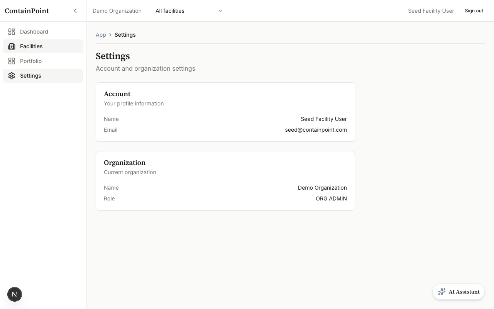

**Settings** covers organization-level preferences and membership context for the signed-in user.

---

## Feature Reference

### Navigation

| Context    | Sidebar items                                                                 |
|------------|-------------------------------------------------------------------------------|
| Global     | Dashboard, Facilities, Portfolio, Settings                                    |
| Facility   | Dashboard, Setup, Profile, Applicability, Assets, Containment, Plan, Inspections, Corrective Actions, Training, Incidents, Exports, Assistant, Obligations |

### Key Workflows

1. **Setup wizard** — Guided flow for applicability, qualification, profile, accountable person, and initial assets/containment
2. **Plan approval** — Create draft → edit sections → approve with certification → version locked
3. **5-year review** — Schedule review → complete with checklist → optionally create amendment
4. **Inspection** — Create template → schedule → run inspection → sign & lock → create corrective actions if needed
5. **Export** — Request export type → system generates document → download artifact

### Validation Engine

The validation engine evaluates:

- Hard failures: overdue inspections, unsigned records, missing containment, etc.
- Risk flags: incomplete templates, narrative gaps, etc.

Status is shown on the facility dashboard and in the portfolio.

---

## Tech Stack

| Layer      | Technology                        |
|------------|-----------------------------------|
| Framework  | Next.js 16 (App Router)           |
| Language   | TypeScript                        |
| Styling    | Tailwind CSS                      |
| Database   | PostgreSQL + Prisma 7             |
| Auth       | NextAuth v5 (credentials)         |
| Validation | Zod                               |
| Forms      | React Hook Form                   |
| UI         | Radix UI, Lucide icons            |
| Assistant  | OpenAI (`ai` SDK), optional Supabase for file storage |
| PDF / export | `@react-pdf/renderer` (and related export pipelines) |

---

## Project Structure

```
src/
├── app/                    # Next.js App Router
│   ├── app/               # Main app (authenticated)
│   │   ├── facilities/    # Facility-scoped pages
│   │   │   └── [facilityId]/
│   │   │       ├── plan/          # Plan overview & version detail
│   │   │       ├── incidents/     # Incident log
│   │   │       ├── exports/       # Export center
│   │   │       ├── assets/        # Asset registry
│   │   │       ├── containment/   # Containment registry
│   │   │       ├── inspections/   # Templates, schedule, run
│   │   │       └── ...
│   │   └── portfolio/     # Multi-facility view
│   ├── api/               # API routes
│   └── login/             # Auth pages
├── components/            # Shared UI components
├── lib/                   # Services and utilities
│   ├── plan-service.ts    # Plan CRUD, versioning, approval
│   ├── export-service.ts  # Document generation
│   ├── validation.ts      # Compliance validation engine
│   └── audit.ts           # Audit logging
└── generated/prisma/      # Prisma client
```

---

## Capturing Screenshots

To regenerate the documentation screenshots:

1. **Start the app** — `npm run dev` (PostgreSQL must be reachable; `DATABASE_URL` set)
2. **Ensure DB is seeded** — `npm run db:seed` (uses `seed@containpoint.com` / `Seed1234!` in the script)
3. **Run the capture script** — `npm run screenshots`  
   Optional: `SCREENSHOT_BASE_URL=https://staging.example.com npx tsx scripts/capture-screenshots.ts`

Outputs land in `docs/screenshots/` (`01-login` … `11-inspections`, facility workflows `12-setup` … `18-obligations`, `09-portfolio`, `20-settings`). The Assistant screen captures UI even when `OPENAI_API_KEY` is unset.

---

## License & Support

Proprietary. Contact your organization administrator for access and support.
